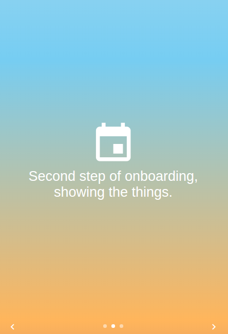

## About
This project was bootstrapped with [Create React App](https://github.com/facebookincubator/create-react-app).
This is a onboarding component written in react. The component can be used to onboard new users to the app. The design is inspired from [Jack Oliver's onboarding component](https://codepen.io/jackoliver/full/XNvRrQ/).

## Screenshots



## How to use
``` bash
$ git clone https://github.com/mohinderps/onboarding.git
$ npm install
$ npm start
```
#### Do star mark the repo in case you like it. Thank you.
